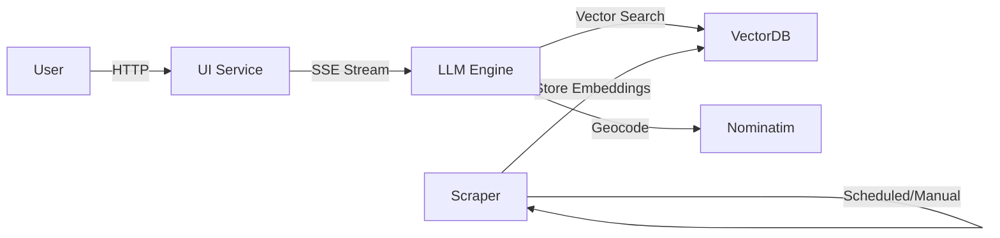

<div align="center">

# 🏠 Uppsala Emergency Shelter Chatbot

**An intelligent, bilingual conversational agent for emergency shelter information**

[](https://www.python.org/downloads/)
[](https://www.docker.com/)
[](https://opensource.org/licenses/MIT)
[](https://ai.google.dev/)


[Features](#-features) •
[Quick Start](#-quick-start) •
[Architecture](#-architecture) •
[Documentation](#-documentation) •
[Contributing](#-contributing)

---

### 🎯 Ask questions, get instant answers, see locations on a map


*An AI-powered assistant that helps Uppsala residents find emergency shelters with intelligent location detection, real-time streaming responses, and interactive maps.*

</div>

---

## ✨ Features

<table>
<tr>
<td width="50%">

### 🤖 **Intelligent AI Assistant**
- **Streaming Responses** - Real-time text generation
- **RAG Pipeline** - Accurate, source-grounded answers
- **Context Awareness** - Multi-turn conversations
- **Gemini 2.0 Flash** - State-of-the-art LLM

</td>
<td width="50%">

### 🗺️ **Location Intelligence**
- **Auto Location Extraction** - Detects places in queries
- **Free Geocoding** - Nominatim (no API key!)
- **Proximity Search** - Find shelters within radius
- **Interactive Maps** - Visual shelter locations

</td>
</tr>
<tr>
<td width="50%">

### 🌍 **Bilingual Support**
- **Swedish & English** - Complete localization
- **Dynamic Translation** - All UI elements
- **Language-aware Examples** - Contextual help
- **Culturally Adapted** - Uppsala-specific knowledge

</td>
<td width="50%">

### 🏗️ **Modern Architecture**
- **Microservices** - 4 independent services
- **Docker Compose** - One-command deployment
- **Vector Search** - ChromaDB semantic search
- **REST APIs** - Clean service interfaces

</td>
</tr>
</table>

---

## 📋 Table of Contents

- [Prerequisites](#-prerequisites)
- [Quick Start](#-quick-start)
- [Configuration](#-configuration)
- [Architecture](#-architecture)
- [Services](#-services)
- [Usage Guide](#-usage-guide)
- [Development](#-development)
- [Troubleshooting](#-troubleshooting)
- [FAQ](#-faq)
- [Contributing](#-contributing)
- [License](#-license)

---

## 🔧 Prerequisites

Before you begin, ensure you have the following installed:

### Required

<table>
<tr>
<td width="30%"><b>🐳 Docker & Docker Compose</b></td>
<td width="70%">

```bash
# Check if Docker is installed
docker --version
docker compose version

# If not installed, visit: https://docs.docker.com/get-docker/
```

</td>
</tr>
<tr>
<td width="30%"><b>🔑 Google API Key</b></td>
<td width="70%">

You'll need a Google API key for Gemini & Embeddings:

1. Go to [Google AI Studio](https://aistudio.google.com/app/apikey)
2. Click **"Get API Key"** → **"Create API key"**
3. Copy the key (starts with `AIza...`)
4. Keep it secure - you'll add it to `.env` later

</td>
</tr>
</table>


## 🚀 Quick Start

Get up and running in **less than 5 minutes**:

### 1️⃣ Clone the Repository

```bash
git clone https://github.com/shelter-llm/shelter-chatbot.git
cd shelter-chatbot
```

### 2️⃣ Set Up Environment Variables

Create a `.env` file in the project root:

# Edit the file and add your Google API key
nano .env  # or use your preferred editor
```

**Update the `.env` file** with your API key:

```properties
# 🔑 REQUIRED: Your Google API Key
GOOGLE_API_KEY="AIzaSy..."  # ← Replace with your actual key

# The following are already configured with defaults:
GEMINI_API_KEY="AIzaSy..."  # ← Same as GOOGLE_API_KEY
MODEL_NAME="gemini-2.0-flash-exp"
TEMPERATURE=0.7
SCRAPE_SCHEDULE="0 2 * * *"
SCRAPE_URL=https://www.allaskyddsrum.se/skyddsrum/uppsala
GRADIO_SERVER_NAME=0.0.0.0
GRADIO_SERVER_PORT=7860
```

### 3️⃣ Launch the Application

```bash
# Build and start all services
docker compose up --build

# Or run in detached mode (background)
docker compose up --build -d
```

**What's happening?** Docker is:
- 📦 Building 4 containerized services
- 🗄️ Setting up ChromaDB vector database
- 🕷️ Scraping shelter data from allaskyddsrum.se
- 🤖 Initializing the LLM engine with Gemini
- 🎨 Starting the Gradio web interface

### 4️⃣ Open the Chatbot

Once you see `Running on local URL:  http://0.0.0.0:7860`, open your browser:

```
🌐 http://localhost:7860
```

**🎉 That's it! Start asking questions:**

<table>
<tr>
<td width="50%">

**🇸🇪 Swedish Examples:**
- *"Hitta skyddsrum nära Centralstationen"*
- *"Vilket är det största skyddsrummet?"*
- *"Finns det tillgängliga skyddsrum för rullstol?"*

</td>
<td width="50%">

**🇬🇧 English Examples:**
- *"Find shelters near Central Station"*
- *"What's the largest shelter?"*
- *"Are there wheelchair accessible shelters?"*

</td>
</tr>
</table>

---

## ⚙️ Configuration

### Environment Variables Explained

| Variable | Description | Default | Required |
|----------|-------------|---------|----------|
| `GOOGLE_API_KEY` | Google API key for Gemini & Embeddings | - | ✅ Yes |
| `GEMINI_API_KEY` | Alias for Google API key | `GOOGLE_API_KEY` | ✅ Yes |
| `MODEL_NAME` | Gemini model to use | `gemini-2.0-flash-exp` | No |
| `TEMPERATURE` | Response randomness (0.0-1.0) | `0.7` | No |
| `SCRAPE_SCHEDULE` | Cron schedule for data updates | `0 2 * * *` | No |
| `SCRAPE_URL` | Source URL for shelter data | allaskyddsrum.se | No |
| `GRADIO_SERVER_NAME` | Server bind address | `0.0.0.0` | No |
| `GRADIO_SERVER_PORT` | UI port | `7860` | No |

### Advanced Configuration

<details>
<summary><b>🔍 Click to expand advanced options</b></summary>

#### Custom Model Selection

```properties
# Use a different Gemini model
MODEL_NAME="gemini-1.5-pro"  # More capable but slower
MODEL_NAME="gemini-1.5-flash"  # Faster but less capable
```

#### Adjust Response Style

```properties
# More creative responses (0.0 = deterministic, 1.0 = creative)
TEMPERATURE=0.9

# More conservative responses
TEMPERATURE=0.3
```

#### Change Scraping Schedule

```properties
# Run every hour
SCRAPE_SCHEDULE="0 * * * *"

# Run twice daily (2 AM and 2 PM)
SCRAPE_SCHEDULE="0 2,14 * * *"

# Manual mode (disable automatic scraping)
SCRAPE_SCHEDULE=""
```

#### Custom Ports

```properties
# Change UI port (if 7860 is occupied)
GRADIO_SERVER_PORT=8080

# Then access at: http://localhost:8080
```

</details>

---

## 🏗️ Architecture

The system uses a **microservices architecture** with four independent services:

```
┌─────────────────────────────────────────────────────────────────┐
│                     🎨 USER INTERFACE (UI)                      │
│                      Gradio • Port 7860                         │
│  • Bilingual chat interface  • Real-time streaming             │
│  • Interactive maps         • Location search                   │
└────────────────────┬────────────────────────────────────────────┘
                     │ HTTP/SSE
                     ▼
┌─────────────────────────────────────────────────────────────────┐
│                   🤖 LLM ENGINE (RAG Pipeline)                  │
│                     FastAPI • Port 8001                         │
│  • Gemini 2.0 Flash        • Location extraction               │
│  • Context retrieval       • Response streaming                │
└────────┬────────────────────────────────────────────┬───────────┘
         │                                            │
         │ Vector Search                              │ Geocoding
         ▼                                            ▼
┌────────────────────────┐              ┌─────────────────────────┐
│  🗄️ VECTOR DATABASE   │              │  🌍 GEOCODING          │
│   ChromaDB • Port 8000 │              │   Nominatim (FREE)     │
│  • Semantic search     │              │  • Address lookup      │
│  • 768-dim embeddings  │              │  • No API key needed   │
└────────┬───────────────┘              └─────────────────────────┘
         │
         │ Data Updates
         ▼
┌─────────────────────────────────────────────────────────────────┐
│                    🕷️ DATA SCRAPER                             │
│                     FastAPI • Port 8002                         │
│  • Web scraping (allaskyddsrum.se)  • Data processing          │
│  • Embedding generation             • Scheduled updates        │
└─────────────────────────────────────────────────────────────────┘
```

### Service Communication



---

## 🔬 Services

### 1. 🗄️ Vector Database Service

**Container**: `shelter-vectordb`  
**Port**: `8000`  
**Technology**: ChromaDB with SQLite backend

**Purpose**: Stores shelter data as semantic embeddings for similarity search.

**Key Features**:
- Persistent storage (`./chromadb_data` volume)
- Google text-embedding-004 (768 dimensions)
- Metadata filtering (location, capacity, accessibility)
- Cosine similarity search

**API Endpoints**:
```bash
# Health check
curl http://localhost:8000/health

# Search shelters
curl -X POST http://localhost:8000/search \
  -H "Content-Type: application/json" \
  -d '{"query": "wheelchair accessible", "n_results": 5}'
```

---

### 2. 🕷️ Data Scraper Service

**Container**: `shelter-scraper`  
**Port**: `8002`  
**Technology**: BeautifulSoup, httpx

**Purpose**: Automated data acquisition from allaskyddsrum.se

**Key Features**:
- Scheduled scraping (default: daily at 2 AM)
- HTML parsing and data extraction
- Embedding generation via Google API
- Automatic database updates

**Manual Trigger**:
```bash
# Trigger scraping manually
curl -X POST http://localhost:8002/scrape/trigger

# Check scraper status
curl http://localhost:8002/health
```

---

### 3. 🤖 LLM Engine Service

**Container**: `shelter-llm-engine`  
**Port**: `8001`  
**Technology**: Google Gemini 2.0 Flash, FastAPI

**Purpose**: RAG pipeline for intelligent question answering

**Key Features**:
- Retrieval-Augmented Generation
- Location extraction (NER for Uppsala)
- Conversation history management
- Server-Sent Events streaming
- Source attribution

**API Example**:
```bash
# Chat with streaming
curl -X POST http://localhost:8001/chat/stream \
  -H "Content-Type: application/json" \
  -d '{
    "message": "Find shelters near Ångström",
    "language": "en",
    "max_context_docs": 5
  }'
```

---

### 4. 🎨 User Interface Service

**Container**: `shelter-ui`  
**Port**: `7860`  
**Technology**: Gradio, Folium

**Purpose**: Interactive web interface

**Key Features**:
- Real-time streaming chat
- Bilingual support (Swedish/English)
- Interactive maps with Folium
- Location search and filtering
- Responsive design

**Access**: http://localhost:7860

---

## 📖 Usage Guide

### Basic Workflow

1. **Select Language** 🌍
   - Choose Svenska (Swedish) or English
   - All UI elements update automatically

2. **Ask Questions** 💬
   - Type natural language queries
   - Responses stream in real-time
   - Sources appear below each answer

3. **View Locations** 🗺️
   - Click shelters in the chat to see details
   - Use the map to visualize locations
   - Filter by distance and count

### Example Queries

<table>
<tr>
<th>Query Type</th>
<th>Example (Swedish)</th>
<th>Example (English)</th>
</tr>
<tr>
<td><b>🔍 Location Search</b></td>
<td><i>"Visa skyddsrum nära Centralstationen"</i></td>
<td><i>"Show shelters near Central Station"</i></td>
</tr>
<tr>
<td><b>📊 Capacity Info</b></td>
<td><i>"Vilket skyddsrum rymmer flest personer?"</i></td>
<td><i>"Which shelter has the largest capacity?"</i></td>
</tr>
<tr>
<td><b>♿ Accessibility</b></td>
<td><i>"Finns det rullstolsanpassade skyddsrum?"</i></td>
<td><i>"Are there wheelchair accessible shelters?"</i></td>
</tr>
<tr>
<td><b>🏘️ District Search</b></td>
<td><i>"Skyddsrum i Gottsunda"</i></td>
<td><i>"Shelters in Gottsunda"</i></td>
</tr>
<tr>
<td><b>📍 Proximity</b></td>
<td><i>"Närmaste skyddsrum från Ångström"</i></td>
<td><i>"Closest shelter from Ångström"</i></td>
</tr>
</table>

### Advanced Features

#### 📍 Location Search Panel

1. Enter a location name (e.g., "Centralstationen")
2. Adjust the radius slider (0.5-10 km)
3. Set max shelters to display
4. Click "Hitta skyddsrum" / "Find Shelters"
5. View results on the interactive map

#### 🗺️ Interactive Map

- **Markers**: Each shelter has a clickable marker
- **Popups**: Click markers for details (name, capacity, address)
- **User Location**: Blue marker shows your searched location
- **Google Maps**: Click "Open in Google Maps" for directions

#### 💬 Conversation Context

The chatbot remembers your conversation:
```
You: "Show shelters in Centrum"
Bot: [Lists shelters]
You: "Which one is largest?"  ← Context-aware!
Bot: "The largest in Centrum is..."
```

---

## 🛠️ Development

### Project Structure

```
shelter-chatbot/
├── 📄 docker-compose.yml       # Service orchestration
├── 📄 .env                     # Environment configuration
├── 📄 pyproject.toml          # Project metadata
├── 📁 services/
│   ├── 📁 vectordb/           # ChromaDB service
│   │   ├── Dockerfile
│   │   ├── main.py
│   │   ├── chromadb_manager.py
│   │   └── requirements.txt
│   ├── 📁 scraper/            # Data scraping service
│   │   ├── Dockerfile
│   │   ├── main.py
│   │   ├── scraper.py
│   │   ├── processor.py
│   │   └── requirements.txt
│   ├── 📁 llm-engine/         # RAG pipeline service
│   │   ├── Dockerfile
│   │   ├── main.py
│   │   ├── rag_engine.py
│   │   └── requirements.txt
│   └── 📁 ui/                 # Gradio interface
│       ├── Dockerfile
│       ├── app.py
│       ├── map_generator.py
│       ├── interactive_map.py
│       └── requirements.txt
├── 📁 shared/                 # Shared utilities
│   ├── __init__.py
│   ├── config.py
│   └── models.py
├── 📁 data/                   # Data storage
│   ├── raw/
│   └── processed/
├── 📁 chromadb_data/          # Vector DB persistence
└── 📁 tests/                  # Test suite
    ├── test_scraper.py
    ├── test_vectordb.py
    └── test_integration.py
```

### Docker Commands

```bash
# Build specific service
docker compose build ui

# Start specific service
docker compose up ui

# View logs
docker compose logs -f llm-engine

# Stop all services
docker compose down

# Stop and remove volumes (fresh start)
docker compose down -v

# Restart a service
docker compose restart scraper
```

### Local Development

```bash
# Install dependencies for a service
cd services/ui
pip install -r requirements.txt

# Run service locally (requires .env)
python app.py

# Run tests
pytest tests/
```


## 📄 License

This project is licensed under the **MIT License** - see the [LICENSE](LICENSE) file for details.

```
MIT License

Copyright (c) 2025 Uppsala AI Safety Initiative

Permission is hereby granted, free of charge, to any person obtaining a copy
of this software and associated documentation files...
```
